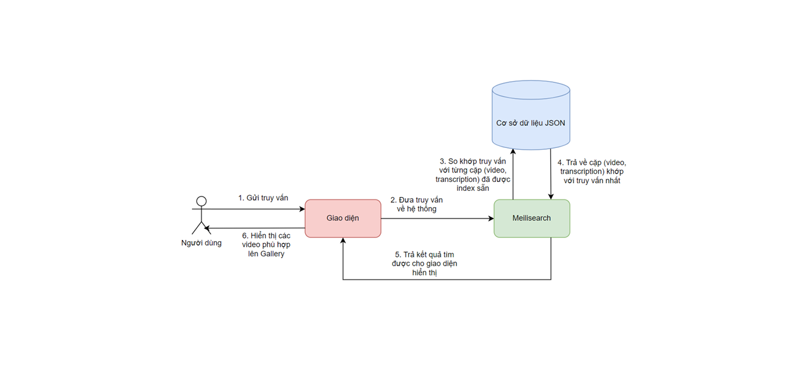
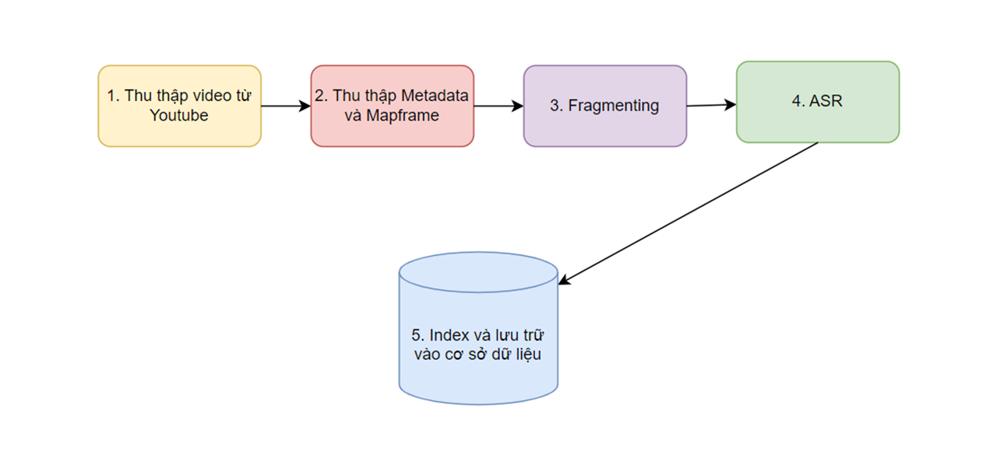
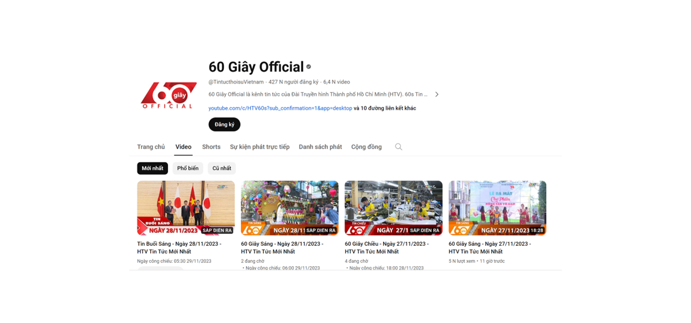
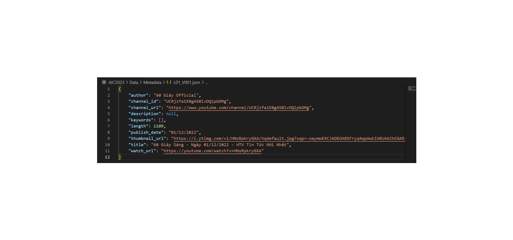
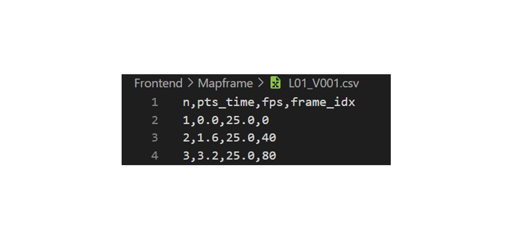
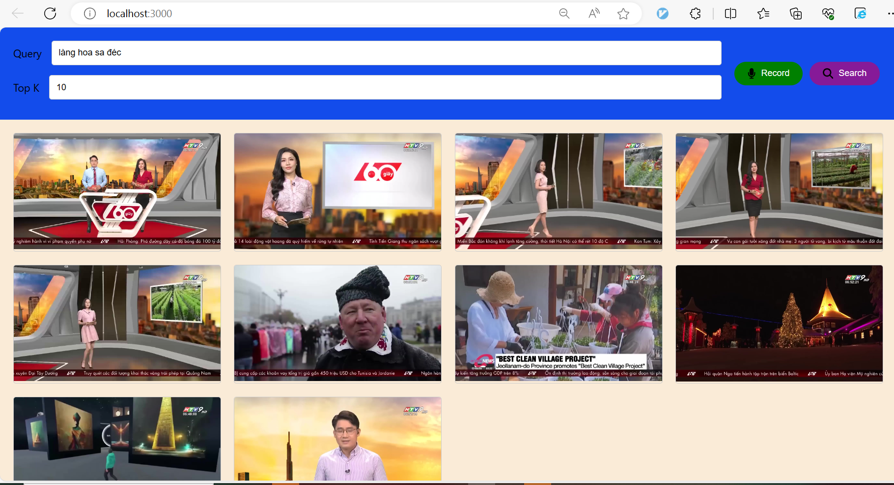
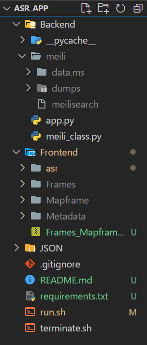

# Giới thiệu và hướng dẫn về đồ án web truy vấn tin tức bằng ASR:
Thành viên: <br>
Lê Ngô Minh Đức (21520195) <br>
Đoàn Nhật Sang (21522542) <br>

## 1. Giới thiệu

Flow làm việc chung của hệ thống: <br>


## 2. Phương pháp index



Cụ thể từng bước như sau:

### 2.1. Thu thập video từ Youtube

Các video sử dụng trong hệ thống được crawl từ channel 60 Giây Official, đây là channel uy tín chuyên đăng tải các video về tin tức ở Thành phố Hồ Chí Minh và cập nhật lượng video hằng ngày.

Trong hệ thống, nhóm sử dụng data batch L01 (batch thứ nhất trên tổng số 30 batch) của kì thi AIC2023, gồm 31 video, mỗi video có độ dài từ 15-25 phút. <br>


### 2.2. Thu thập Metadata và Mapframe

Nhóm sử dụng Metadata và Mapframe được cung cấp sẵn bởi BTC, trong đó:

-   Metadata là các file JSON chứa các thông tin ngoài lề của video tương ứng như link Youtube, ngày phát hành, độ dài, mô tả, ...

-   Mapframe là các file csv, mỗi file chứa bốn trường **n, pts_time, fps, frame_idx** lần lượt cho biết frame thứ n có timestamp là giây bao nhiêu, fps bao nhiêu và là frame thứ mấy trong list frame của video.


*Metadata*


*Mapframe*

### 2.3. Fragmenting

Fragmenting là việc cắt rời một đoạn video thành nhiều đoạn nhỏ. Ở đây mỗi video được cắt theo từng fragment và không overlap lên nhau: **(frame_idx[n], frame_idx[n+3])**

Trong quá trình cắt, nhóm có lọc ra những fragment có độ dài không quá 2 giây vì những audio này khi đưa vào mô hình ASR sẽ cho ra transcription quá ngắn.

### 2.4. ASR

Tiếp theo ta đưa từng fragment (là một file .wav được cắt ra từ video gốc) vào mô hình ASR.

Nhóm đã thử nghiệm hai mô hình là Conformer (finetuned) và Wav2vec2 (pretrained), kết quả thực nghiệm như hình:

|     | Conformer | Wav2vec2.0 (4-gram)                   |
| --- | --------- | ------------------------------------- |
| WER | 0.2363    | <span style="color:red">0.0630</span> |

Sau thực nghiệm, nhóm chọn mô hình Wav2vec2 làm backbone ASR để tạo ra transcription cho database vì nó đạt WER tốt hơn.

## 3. Giao diện & hướng dẫn sử dụng



Web gồm có hai chức năng truy vấn:

**1. Text query:** người dùng nhập một đoạn truy vấn cần tìm (chẳng hạn "Làng hoa sa đéc") và ấn "Search". <br>
**2. Audio query:** người dùng ấn nút "Record" để bắt đầu ghi âm, sau đó người dùng nói ra query (chẳng hạn "Làng hoa sa đéc"). Sau khi kết thúc câu, hệ thống sẽ tự động ngừng ghi âm và điền vào thanh Text query, sau đó chỉ cần ấn "Search" như thường.

Sau khi ấn "Search", hệ thống sẽ xuất ra một Gallery gồm nhiều video, người dùng cần kiểm tra video có chứa query của mình không bằng cách ấn vào từng thumbnail, hệ thống sẽ dẫn người dùng đến link Youtube của video đó, ngay tại thời điểm query được nhắc đến.

## 4. Performance:

Sau khi đánh giá trên 100 câu query mẫu, với topk=5, nhóm đo được hệ thống cho kết quả chính xác với Accuracy@5 = 72%.

# Hướng dẫn về source code:

## Lưu ý:

Hệ thống gồm 3 phần:

-   API meilisearch: là database chính của hệ thống, được host trên môi trường WSL
-   API của thư viện FastAPI: hỗ trợ việc truy vấn, được host trên môi trường Windows
-   Giao diện React frontend: được host trên môi trường Windows (mặc định người dùng đã cài sẵn nodejs, thư viện React và SCSS)

Workspace nên có cấu trúc như sau:


## Hướng dẫn reproduce:

Trong file .gitignore đã ignore một số thư mục: <br>
**Frontend/Frames <br>
Frontend/Mapframe <br>
Frontend/Metadata <br>
Frontend/asr/node_modules <br>
Backend/meili <br>** 

Vì vậy để reproduce code, ta cần tải các thư mục Frames, Mapframe, Metadata và đặt chúng vào đúng vị trí như hình bằng cách download ở <a href="https://drive.google.com/file/d/1undA9V5SPITUk_7H1HLpFnSRFrX-iKuQ/view?usp=sharing">đây</a>

Tiếp theo ta vào folder Backend tạo folder meili, sau đó tải file meilisearch (trong WSL terminal) về bằng command:

```
curl -L https://install.meilisearch.com | sh
```

Sau đó cài sẵn một conda env có tên **asr_app** (trong Windows terminal), và tải các thư viện trong file **requirements.txt**:

```
conda create --name asr_app
pip install -r requirements.txt
```

Sau đó cd vào thư mục Frontend/asr và cài node_modules:
`npm install`

Cuối cùng để start hệ thống (trong WSL terminal):
`bash run.sh`

Để dừng hệ thống (trong WSL terminal):
`bash terminate.sh`

(Lưu ý: nếu người dùng không sử dụng Windows thì cần phải chỉnh file run.sh và terminate.sh lại cho phù hợp với hệ điều hành.)
